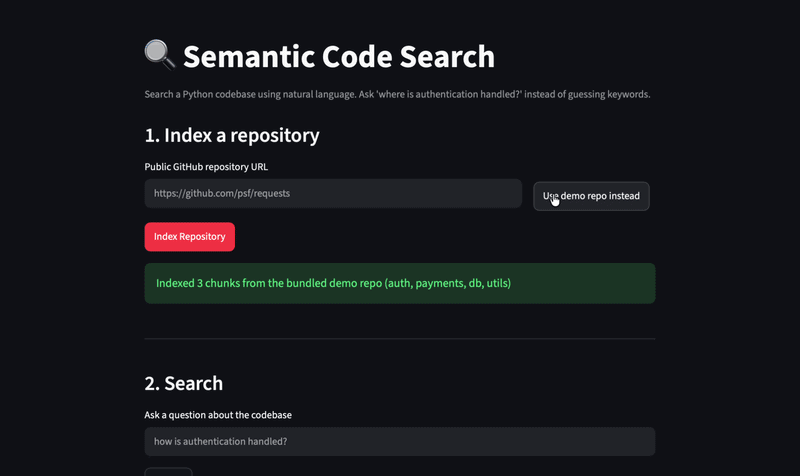

# Semantic Code Search

Search a Python codebase using natural language instead of exact keyword matching.

Ask "where is authentication handled?" or "show session management code" and
get back the actual functions and classes that answer it — even when those
exact words don't appear anywhere in the code.



## How it works

```
Repo (.py files)
   |
   v
AST parsing (Python's ast module) -> extract functions & classes
   |
   v
Embed each chunk (sentence-transformers, all-MiniLM-L6-v2)
   |
   v
Store in ChromaDB (vector + metadata: file, line numbers, name, type)
   |
   v
Query embedding -> cosine similarity search -> ranked results
```

Test files (`tests/`, `test_*.py`) are excluded from indexing by default —
see [Design decisions](#design-decisions) below for why.

## Benchmarks

Measured against [`psf/requests`](https://github.com/psf/requests) (a real,
well-known open-source library) on a MacBook Air, CPU only, no GPU.

| Metric | Value |
|---|---|
| Chunks indexed | 127 |
| Index time | 2.77s |
| Avg query latency | 13.5ms (10 queries) |
| Precision@3 | 90% (27/30 relevant results, manually judged) |

Reproduce it yourself:
```bash
git clone https://github.com/psf/requests
python3 -m benchmarks.bench requests
```

### Example queries against `requests`

| Query | Top result |
|---|---|
| "connection timeout" | `ConnectTimeout` |
| "how is authentication handled" | `HTTPBasicAuth` |
| "session management" | `session()` |
| "handling redirects" | `TooManyRedirects` |

## Design decisions

**Test files are excluded from the index by default.** Early benchmarking
showed test functions (e.g. `test_get_auth_from_url`) frequently outranked
real implementation code in search results, since test names often literally
contain the feature name being searched for. Filtering them improved
precision@3 from 63% to 90% on the same query set. Pass `include_tests=True`
to `chunk_repository()` if you want them indexed anyway.

**Centralized data access.** All ChromaDB reads/writes go through
`src/store/vector_store.py`; all search goes through
`src/retriever/retriever.py`. Nothing else touches the vector store directly.
This was a deliberate refactor — the project originally had indexing/search
logic duplicated across three files, which led to a real bug (the UI sent
`repo_url` while the API expected `repo_path`) that a single source of truth
would have prevented.

## Quickstart

```bash
git clone https://github.com/Rachel-Mathew25/semantic-code-search
cd semantic-code-search
python3 -m venv .venv
source .venv/bin/activate
pip install -r requirements.txt

# Index a local repo
python3 -m src.index_repository /path/to/some/repo

# Search it
python3 -m src.search

# Or run the API + UI
uvicorn src.api.main:app --reload
streamlit run ui/app.py
```

## Architecture

```
src/
├── indexer/
│   ├── parser.py       # AST-based Python parsing
│   ├── chunker.py      # extract function/class-level chunks
│   └── embedder.py     # sentence-transformers embedding
├── store/
│   └── vector_store.py # ChromaDB wrapper (single source of truth)
├── retriever/
│   └── retriever.py    # query embedding -> similarity search
├── api/
│   └── main.py         # FastAPI: /index, /search
├── index_repository.py # CLI indexing entrypoint
└── search.py            # CLI search entrypoint
ui/
└── app.py               # Streamlit frontend
benchmarks/
└── bench.py              # indexing + latency + precision@3 benchmark
```

## Roadmap

- [x] AST-based Python parsing & chunking
- [x] Embedding + ChromaDB storage
- [x] FastAPI backend + Streamlit UI
- [x] Benchmarking against a real open-source repo
- [ ] Cross-encoder reranking (second-stage precision improvement)
- [ ] Unit test suite
- [ ] Live deployment (Hugging Face Spaces)
- [ ] Multi-language support (tree-sitter: Java, JavaScript, TypeScript)

## Limitations

- Python only (AST-based parsing; no tree-sitter yet)
- No reranking stage yet — retrieval is single-pass cosine similarity
- "Setting request headers"-style queries are the weakest case so far
  (1/3 precision in testing) — header-related code is scattered across
  multiple unrelated-looking functions in most codebases
